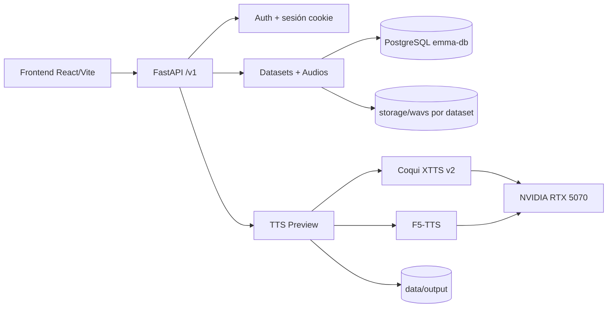
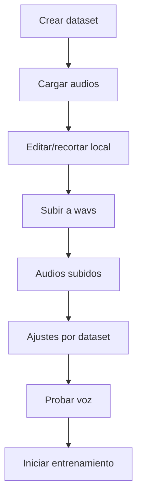
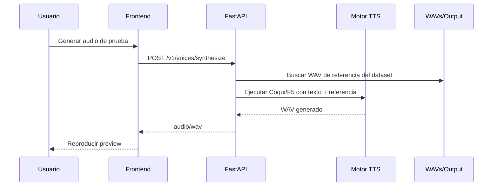

# EMMA

Plataforma para gestionar datasets de voz, preparar audios y generar preview TTS con motores de IA.

## Stack

- Backend: `FastAPI` + `PostgreSQL` (`emma-db`)
- Frontend: `React + Vite`
- Audio IA: `Coqui XTTS v2` y `F5-TTS`
- GPU: `PyTorch CUDA` (RTX 5070)

## Arquitectura



## Flujo de Entrenamiento (módulo)



## Flujo de Preview



## Requisitos

- Windows 10/11
- Python 3.11
- Node.js 20+
- PostgreSQL (DB: `emma-db`)
- GPU NVIDIA + drivers al día

## Configuración inicial

### 1) Clonar e instalar backend

```powershell
cd E:\UTILES
git clone https://github.com/bvasquezkeysije/EMMA.git
cd EMMA
python -m venv .venv
.\.venv\Scripts\Activate.ps1
python -m pip install -r requirements.txt
```

### 2) Base de datos

- Usuario: `postgres`
- Password: `postgres`
- DB: `emma-db`

Aplicar migraciones SQL desde `db/migrations` (al menos `0002_emma_db_full.sql` y `0003_dataset_settings.sql`).

### 3) Frontend

```powershell
cd E:\UTILES\EMMA\frontend
npm install
```

## Ejecución

### Opción A: desarrollo (frontend + backend separados)

Terminal 1:

```powershell
cd E:\UTILES\EMMA\frontend
npm run dev
```

Terminal 2:

```powershell
cd E:\UTILES\EMMA
.\.venv\Scripts\Activate.ps1
python -m uvicorn app.main:app --reload --host 127.0.0.1 --port 8090
```

### Opción B: backend con `run.py`

```powershell
cd E:\UTILES\EMMA
.\.venv\Scripts\Activate.ps1
python run.py
```

## Módulos principales

- `Inicio`
- `Entrenamiento`
- `Voces`

## Persistencia de ajustes por dataset

Se guardan en DB (`dataset_settings`) estos campos:

- `engine`
- `audio_channels`
- `sample_rate`
- `quality_mode`
- `speed_rate`
- `precision_mode`
- `temperature`
- `top_k`
- `top_p`
- `noise_scale`

## Estructura del proyecto

```text
EMMA/
├─ app/                    # Backend FastAPI
├─ frontend/               # UI React + Vite
├─ db/migrations/          # SQL migrations
├─ data/datasets/          # Datasets y wavs
├─ data/output/            # Audios de preview generados
└─ storage/                # Storage adicional del proyecto
```

## Notas

- El preview TTS usa motor real (Coqui/F5) y fallback solo si falla.
- Para mejor calidad, usar audios WAV limpios en `wavs`.
- Si Git en Windows bloquea `.git/index`, ajustar permisos con `icacls`.
